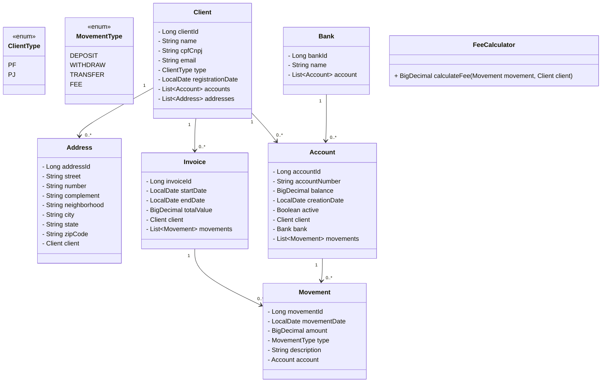

# SmartBudget

**SmartBudget** is a financial management application designed to help users track and optimize their budgets effectively.

## Features

- Manage and track financial budgets.
- Store data using H2 or Oracle databases.
- RESTful API for integration with other systems.
- Built with Spring Boot for rapid development.

## Technologies

- **Java 8**
- **Spring Boot 2.5.14**
  - Spring Data JPA
  - Spring Web
- **H2 Database** (runtime)
- **Oracle JDBC Driver** (runtime)
- **Lombok** (for reducing boilerplate code)
- **Maven** (build tool)

## Prerequisites

- Java 1.8 or higher
- Maven 3.6 or higher
- (Optional) Oracle Database for production use

## Architecture



## Getting Started

1. Clone the repository:
   ```bash
   git clone https://github.com/your-username/smart-budget.git
   cd smart-budget
