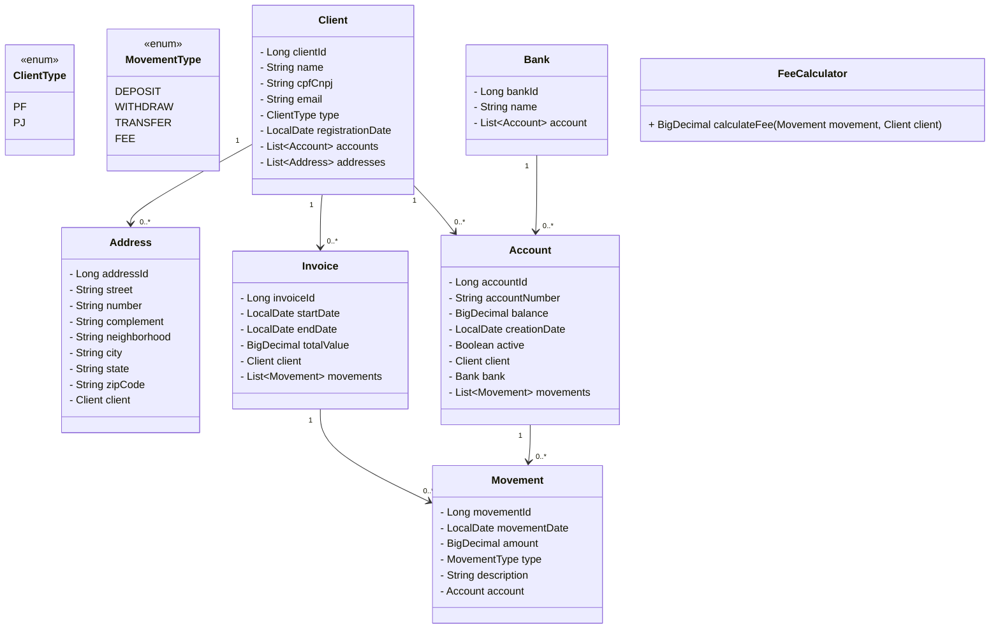

# SmartBudget

**SmartBudget** is a financial management application designed to help users track and optimize their budgets effectively.

## Features

- Manage and track financial budgets.
- Store data using H2 or Oracle databases.
- RESTful API for integration with other systems.
- Built with Spring Boot for rapid development.

## Technologies

- **Java 8**
- **Spring Boot 2.5.14**
  - Spring Data JPA
  - Spring Web
- **H2 Database** (runtime)
- **Oracle JDBC Driver** (runtime)
- **Lombok** (for reducing boilerplate code)
- **Maven** (build tool)

## Prerequisites

- Java 1.8 or higher
- Maven 3.6 or higher
- (Optional) Oracle Database for production use

## Architecture



## Business Rules

- Accounts with movements cannot be modified (only status can change).
- Movement amount must be ≥ 1.
- Withdrawals (WITHDRAW) can only be performed if the account balance is sufficient.
- Accounts and movements simulate external API integration.
- Soft deletion for accounts and clients (changing active status).

## Getting Started

1. Clone the repository:
   ```bash
   git clone https://github.com/your-username/smart-budget.git
   cd smart-budget
   ```
   
## Main Endpoints

- **Client**
  - **GET /v1/api/clients**           # Get all clients
  - **GET /v1/api/clients/{id}**     # Get client by ID
  - **POST /v1/api/clients**          # Create client
  - **PUT /v1/api/clients/{id}**      # Update client
  - **PUT /v1/api/clients/change-status/{id}** # Activate/Deactivate client
 
- **Account**
  - **GET /v1/api/accounts/{id}**                  # Get account by ID
  - **GET /v1/api/accounts/client/{clientId}**    # Get all accounts of a client
  - **GET /v1/api/accounts/active**               # Get all active accounts
  - **POST /v1/api/accounts**                     # Create account
  - **PUT /v1/api/accounts/change-status/{id}**   # Activate/Deactivate account
  - **PUT /v1/api/accounts/{id}**                 # Update account (cannot modify if it has movements)
 
- **Movement**
  - **GET /v1/api/movements/{id}**                # Get movement by ID
  - **GET /v1/api/movements/account/{accountId}** # Get all movements of an account
  - **POST /v1/api/movements**                    # Create movement (deposit, withdraw, transfer)
 
- **Address**
  - **GET /v1/api/addresses/{id}**                  # Get address by ID
  - **GET /v1/api/addresses/client/{clientId}**    # Get all addresses of a client
  - **POST /v1/api/addresses**                     # Create address for a client
  - **PUT /v1/api/addresses/{id}**                 # Update address
  - **PUT /v1/api/addresses/change-status/{id}**   # Activate/Deactivate address (optional)
 
