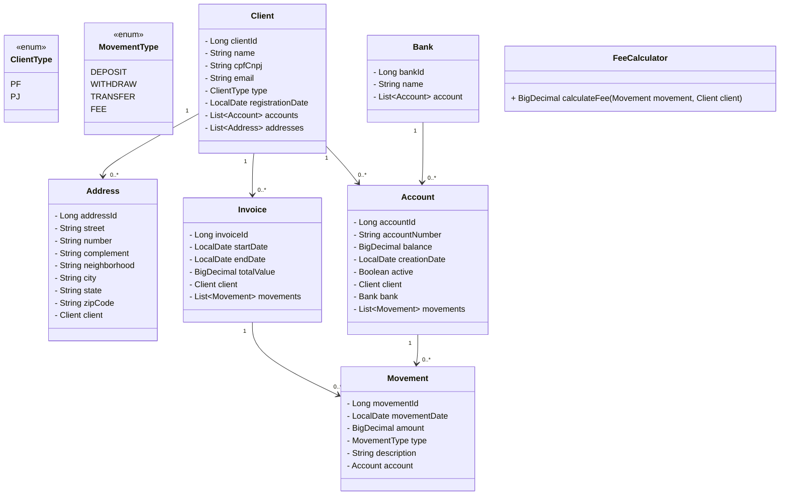

# SmartBudget

**SmartBudget** is a financial management application designed to help users track and optimize their budgets effectively.

## Features

- Manage and track financial budgets.
- Store data using H2 or Oracle databases.
- RESTful API for integration with other systems.
- Built with Spring Boot for rapid development.

## Technologies

- **Java 8**
- **Spring Boot 2.5.14**
  - Spring Data JPA
  - Spring Web
- **H2 Database** (runtime)
- **Oracle JDBC Driver** (runtime)
- **Lombok** (for reducing boilerplate code)
- **Maven** (build tool)

## Prerequisites

- Java 1.8 or higher
- Maven 3.6 or higher
- (Optional) Oracle Database for production use

## Architecture



**Fee Calculation Procedure (Oracle PL/SQL)**

The project uses a stored procedure in Oracle to calculate fees based on the number of movements:

```sql
CREATE OR REPLACE PROCEDURE XPTO.CALCULATE_FEE (
    p_movements_count IN NUMBER,
    p_fee OUT NUMBER
)
AS
BEGIN
    IF p_movements_count <= 10 THEN
        p_fee := 1.0 * p_movements_count;
    ELSIF p_movements_count <= 20 THEN
        p_fee := 0.75 * p_movements_count;
    ELSE
        p_fee := 0.5 * p_movements_count;
    END IF;
END;
```

- Parameters:

  - p_movements_count (IN): number of account movements.

  - p_fee (OUT): calculated fee based on the rules:

    - ≤ 10 movements → 1.0 per movement

    - 11–20 movements → 0.75 per movement

    - 20 movements → 0.5 per movement

- This procedure is called from Java using JdbcTemplate with a CallableStatement.

- It centralizes the fee calculation logic in the database, making it reusable and consistent across applications.

## Business Rules

- Accounts with movements cannot be modified (only status can change).
- Movement amount must be ≥ 1.
- Withdrawals (WITHDRAW) can only be performed if the account balance is sufficient.
- Accounts and movements simulate external API integration.
- Soft deletion for accounts and clients (changing active status).

## Getting Started

1. Clone the repository:
   ```bash
   git clone https://github.com/your-username/smart-budget.git
   cd smart-budget
   ```
   
## Main Endpoints

- **Client**
  - **GET /v1/api/clients**           # Get all clients
  - **GET /v1/api/clients/{id}**     # Get client by ID
  - **POST /v1/api/clients**          # Create client
  - **PUT /v1/api/clients/{id}**      # Update client
  - **PUT /v1/api/clients/change-status/{id}** # Activate/Deactivate client
 
- **Account**
  - **GET /v1/api/accounts/{id}**                  # Get account by ID
  - **GET /v1/api/accounts/client/{clientId}**    # Get all accounts of a client
  - **GET /v1/api/accounts/active**               # Get all active accounts
  - **POST /v1/api/accounts**                     # Create account
  - **PUT /v1/api/accounts/change-status/{id}**   # Activate/Deactivate account
  - **PUT /v1/api/accounts/{id}**                 # Update account (cannot modify if it has movements)
 
- **Movement**
  - **GET /v1/api/movements/{id}**                # Get movement by ID
  - **GET /v1/api/movements/account/{accountId}** # Get all movements of an account
  - **POST /v1/api/movements**                    # Create movement (deposit, withdraw, transfer)
 
- **Address**
  - **GET /v1/api/addresses/{id}**                  # Get address by ID
  - **GET /v1/api/addresses/client/{clientId}**    # Get all addresses of a client
  - **POST /v1/api/addresses**                     # Create address for a client
  - **PUT /v1/api/addresses/{id}**                 # Update address
  - **PUT /v1/api/addresses/change-status/{id}**   # Activate/Deactivate address (optional)

## Reports

The SmartBudget application includes a powerful reporting system that allows generating detailed financial reports for clients and for the company. Reports are generated in **plain text files** and stored in a configurable folder.

### Types of Reports

1. **Client Balance Report**
   - Generates a detailed report for a single client.
   - Includes:
     - Client information (name, registration date, address)
     - Number of credit and debit movements
     - Total movements
     - Fee calculated using the stored procedure
     - Initial and current balance
   - Example method: `generateClientBalanceReport(Long clientId)`

2. **Client Balance Report by Period**
   - Generates a report for a client within a specific date range.
   - Includes:
     - Start and end dates
     - All movements within the period
     - Fee calculation using the stored procedure
   - Example method: `generateClientBalanceReportPeriod(Long clientId, LocalDate start, LocalDate end)`

3. **All Clients Balance Report**
   - Generates a consolidated report of balances for all clients on a specific date.
   - Provides an overview of client balances in the system.
   - Example method: `generateAllClientsBalanceReport(LocalDate date)`

4. **Company Revenue Report**
   - Calculates the total revenue of the company based on client movements and fees.
   - Includes:
     - Movement count per client
     - Revenue generated per client
     - Total revenue in the period
   - Example method: `generateCompanyRevenueReport(LocalDate start, LocalDate end)`
  
## Best Practices

  - Layered Architecture: separation of concerns between Controllers, Services, Repositories, and Entities.
  - Dependency Injection: Spring’s @Autowired for managing dependencies.
  - DTOs: use of Data Transfer Objects to encapsulate request data and avoid exposing entities directly.
  - Validation: input validation in services to ensure business rules (e.g., movement amount ≥ 1, accounts with movements cannot be updated).
  - Transaction Management: @Transactional annotation used to ensure atomic operations when inserting/updating entities.
  - Exception Handling: proper use of exceptions with meaningful messages to indicate errors (e.g., entity not found, invalid type).
  - Unit Testing: thorough test coverage using JUnit 5 and Mockito to mock dependencies and test services in isolation.

## Design Patterns

  - Repository Pattern: for data access (ClientRepository, AccountRepository, etc.) encapsulating all persistence logic.
  - Service Layer Pattern: encapsulates business logic (ClientService, AccountService, InvoiceReportService).
  - Singleton: Spring beans are singleton-scoped by default, ensuring a single instance for services/repositories.
  - Factory / Builder Pattern: DTOs and entity constructors are used as a simplified factory approach to assemble objects.
  - Strategy Pattern: FeeCalculator can be extended for different calculation strategies if business rules change.
  - Observer / Event-Driven (Optional): can be implemented for future real-time notifications or report generation triggers.


